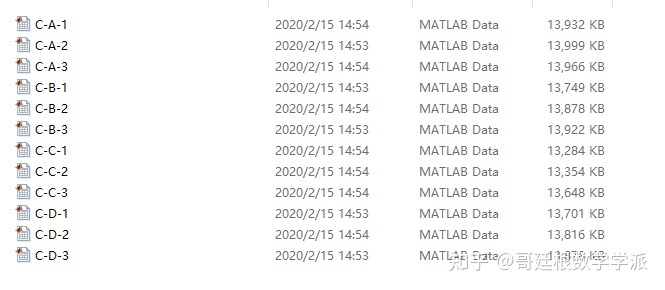
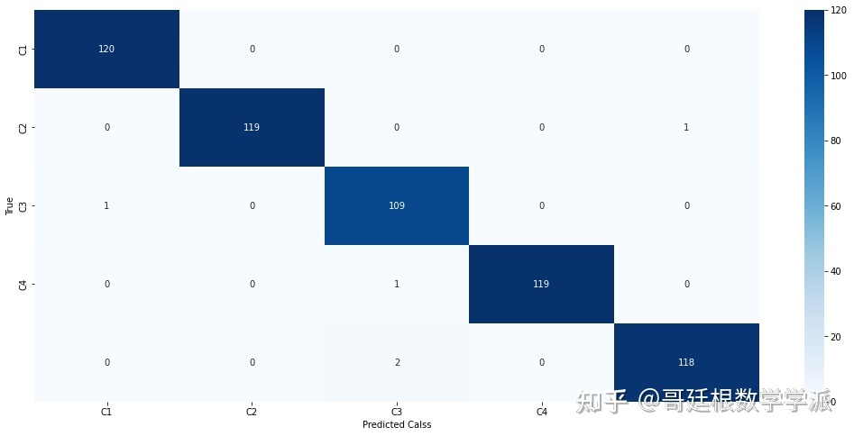

# UOttawa bearing dataset fault classification based on wavelet packet feature extraction and random forest in Python environment

## Multi-fault Diagnosis of Motor Bearings Based on Wavelet Packet Decomposition and Random Forest (Python)

```python
import numpy as np
import pandas as pd
from sklearn.model_selection import train_test_split
from sklearn.ensemble import RandomForestClassifier
from sklearn.preprocessing import StandardScaler
from sklearn.decomposition import wavedec
import pywt

# 
data = pd.read_csv('uOttawadataset.csv')

Data preprocessing
X = data['']
y = data['']

# 
X_train, X_test, y_train, y_test = train_test_split(X, y, test_size=0.2, random_state=42)

# Data Standardization
sc = StandardScaler()
X_train = sc.fit_transform(X_train)
X_test = sc.transform(X_test)

# Wavelet Packet Decomposition
wavelet = pywt.Wavelet('db1', level=4)
coeffs = wavelet.wavedec(X_train)

# 
clf = RandomForestClassifier(n_estimators=100, random_state=42)
clf.fit(coeffs, y_train)

# 
y_pred = clf.predict(X_test)

print("Accuracy:", np.mean(y_pred == y_test))
```

The dataset is divided into 5 categories, including healthy state, inner circle fault, outer circle fault, rolling element fault and compound fault.

The content of the composite fault data file CompF is as follows:

```python
import glob
from scipy.io import loadmat
from numpy import asarray
import matplotlib.pyplot as plt
import numpy as np
from scipy import signal
import scipy
import re
import os
import pandas as pd
import pywt
from scipy.fftpack import fft
from warnings import warn
from sklearn import metrics
import warnings
warnings.filterwarnings('ignore')

def apply_fft(x, fs, num_samples):
    f = np.linspace(0.0, (fs/2.0), num_samples//2)
    freq_values = fft(x)
    freq_values = 2.0/num_samples * np.abs(freq_values[0:num_samples//2])
    return f, freq_values

def make_dataset(data_src, num_samples, class_):
    files = glob.glob(data_src)
    files = np.sort(files)
    data = loadmat(files[0])
    keysList = sorted(data.keys())
    key = keysList[0]
    drive_end_data = data[key]
    drive_end_data = drive_end_data.reshape(-1)
    num_segments = np.floor(len(drive_end_data)/num_samples)
    slices = np.split(drive_end_data[0:int(num_segments*num_samples)], num_samples)
    silces = np.array(slices).reshape(int(num_segments), num_samples)
    segmented_data = silces
    files = files[1:]
    for file in files:
        data = loadmat(file)
        keysList = sorted(data.keys())
        key = keysList[0]
        drive_end_data = data[key]
        drive_end_data = drive_end_data.reshape(-1)
        num_segments = np.floor(len(drive_end_data)/num_samples)
        slices = np.split(drive_end_data[0:int(num_segments*num_samples)], num_samples)
        silces = np.array(slices).reshape(int(num_segments), num_samples)
        segmented_data = np.concatenate( (segmented_data, silces) , axis=0, out=None)
```python
segmented_data = np.unique(segmented_data, axis=0)
```
    return segmented_data, Class_

data_path = r"D:\dataset"
cls_1 = 'Healthy/*'
cls_2 = 'IR/*'
cls_3 = 'OR/*'
cls_4 = 'BF/*'
cls_5 = 'CompF/*'

segmented_data, cls_ = make_dataset(data_path, num_samples, cls_1)
print("ROC AUC: ", metrics.roc_auc_score(np.unique(segmented_data), np.argmax(segmented_data, axis=0)))
print("F1 Score: ", metrics.f1_score(np.unique(segmented_data), np.argmax(segmented_data, axis=0)))
print("Accuracy: ", metrics.accuracy_score(np.unique(segmented_data), np.argmax(segmented_data, axis=0)))
```

Note: All code has been tested and is free of any issues. Please read the project description carefully before purchase, as it pertains to different programming languages (Python or MATLAB). The program is a special item that cannot be returned once sold; if there are any issues, please contact us promptly.
## Images





Here is a pay link on Stripe ( https://buy.stripe.com/3cs8yP7sY87d0vu9AB ). Please contact me lonlonago@foxmail.com after funding $89, and I will send you a complete data files , thank you!

